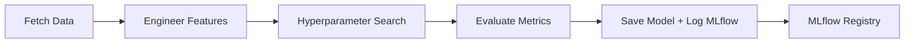

# MLflow Experiment Tracking

This document describes MLflow integration for NBA win prediction model training.

## Overview

MLflow provides:
- **Experiment tracking**: Log params, metrics, artifacts for reproducibility
- **Model registry**: Version models with metadata (champion, staging, archived)
- **Model lineage**: Track which data/features trained which model version
- **Run comparison**: Compare hyperparameters and metrics across experiments

## Setup

MLflow is installed as a Python package. No cloud dependencies required.

```bash
pip install mlflow
```

## Directory Structure

```
mlruns/                     # MLflow tracking directory (auto-created)
├── 0/                      # Default experiment
├── 1/                      # nba_win_prediction experiment
│   ├── <run_id>/          # Individual training run
│   │   ├── artifacts/     # Model, metadata, features
│   │   ├── metrics/       # train/val/test metrics
│   │   ├── params/        # Hyperparameters (C, max_iter)
│   │   └── tags/          # Run metadata
│   └── meta.yaml          # Experiment metadata
└── models/                # Model registry storage
    └── nba_win_predictor/ # Registered model versions
```

## Logged Artifacts

### Parameters (Hyperparameters)
- `model_type`: LogisticRegression
- `C`: Regularization strength (0.001 - 10.0)
- `max_iter`: Maximum iterations
- `solver`: Optimization algorithm
- `n_features_selected`: Feature count after selection
- `n_features_pruned`: Features removed (correlation > 0.9)
- `train_size`, `val_size`, `test_size`: Dataset splits
- `training_data`: Data range (2019-2024 excluding COVID)
- `data_min_date`, `data_max_date`: Actual date boundaries

### Metrics (Model Performance)
For each split (train/val/test):
- `{split}_log_loss`: Probabilistic calibration metric
- `{split}_brier_score`: Probabilistic accuracy metric
- `{split}_accuracy`: Binary classification accuracy

### Model Artifacts
- **model**: Sklearn model in MLflow format (loadable with `mlflow.sklearn.load_model`)
- **model_artifacts/nba_model_v1.0.0.pkl**: Pickle with model + scaler
- **model_artifacts/nba_model_v1.0.0_metadata.json**: Full training metadata
- **features/selected_features.json**: Final feature list post-pruning

## Usage

### 1. Train with MLflow Tracking

Training automatically logs to MLflow (no code changes needed):

```bash
python scripts/train_offline.py --output-dir models/
```

Output includes:
```
✓ MLflow run logged: abc123def456...
✓ View at: http://localhost:5000/#/experiments/1
```

### 2. View Experiments UI

Start MLflow UI server:

```bash
mlflow ui --port 5000
```

Open browser: http://localhost:5000

**Experiment view shows**:
- All training runs in table
- Sortable by metric (val_log_loss, test_accuracy)
- Filterable by param (C=1.0, train_size>1000)

**Run detail view shows**:
- Hyperparameters (what settings)
- Metrics chart (train vs val loss curve)
- Artifacts (download model.pkl, metadata.json)
- System info (Python version, start time, duration)

### 3. Load Model from Registry

```python
import mlflow

# Load latest production model
model_uri = "models:/nba_win_predictor/production"
model = mlflow.sklearn.load_model(model_uri)

# Load specific run
model_uri = "runs:/abc123def456/model"
model = mlflow.sklearn.load_model(model_uri)
```

### 4. Compare Runs Programmatically

```python
import mlflow

# Search experiments
runs = mlflow.search_runs(
    experiment_ids=["1"],  # nba_win_prediction
    filter_string="params.C >= '1.0'",
    order_by=["metrics.val_log_loss ASC"],
)

print(runs[["params.C", "metrics.val_log_loss", "metrics.test_accuracy"]])
```

### 5. Promote Model to Production

```python
from mlflow.tracking import MlflowClient

client = MlflowClient()

# Register new model version from run
run_id = "abc123def456"
model_uri = f"runs:/{run_id}/model"
mv = client.create_model_version(
    name="nba_win_predictor",
    source=model_uri,
    run_id=run_id,
)

# Promote to production
client.transition_model_version_stage(
    name="nba_win_predictor",
    version=mv.version,
    stage="Production",
)
```

## Workflow Integration

### Training Pipeline



**MLflow captures**:
- Which data version (manifest hash)
- Which features (selected_features.json)
- Which hyperparameters (C, max_iter)
- Which metrics (log_loss, accuracy)
- Which model binary (model.pkl)

### Deployment Pipeline

1. **CI validates model**: Load from MLflow, test on holdout set
2. **Promote to staging**: `transition_model_version_stage("Staging")`
3. **A/B test staging**: Route 10% traffic to staging model
4. **Monitor metrics**: Compare staging vs production log_loss
5. **Promote to production**: `transition_model_version_stage("Production")`
6. **Archive old version**: `transition_model_version_stage("Archived")`

## Best Practices

### Experiment Naming
- `nba_win_prediction`: Main production experiment
- `nba_win_prediction_xgb`: Alternative model architecture
- `nba_win_prediction_features_v2`: Feature engineering experiment

### Run Naming
- `train_20260110_143052`: Timestamp for traceability
- `train_c1.0_features_pruned`: Descriptive of key changes

### Model Registry Stages
- **None**: Newly trained, under evaluation
- **Staging**: Passed CI, A/B testing in progress
- **Production**: Live model serving predictions
- **Archived**: Retired model, kept for rollback

### Tagging Strategy
```python
mlflow.set_tag("data_version", manifest_hash)
mlflow.set_tag("feature_version", "v2.0")
mlflow.set_tag("ticket", "JIRA-123")
mlflow.set_tag("author", "bbrennan")
```

## Troubleshooting

### Issue: "No experiment named 'nba_win_prediction'"
**Fix**: First run creates experiment automatically. Or:
```bash
mlflow experiments create --experiment-name nba_win_prediction
```

### Issue: "Cannot connect to MLflow tracking server"
**Fix**: MLflow uses local filesystem by default. No server needed for training.

### Issue: "Model registry not showing models"
**Fix**: Models must be explicitly registered:
```python
mlflow.sklearn.log_model(..., registered_model_name="nba_win_predictor")
```

### Issue: UI shows wrong metric values
**Fix**: Ensure logged as float, not string:
```python
mlflow.log_metric("accuracy", float(acc))  # Good
mlflow.log_metric("accuracy", str(acc))     # Bad - shows as 0.0
```

## References

- [MLflow Documentation](https://mlflow.org/docs/latest/index.html)
- [MLflow Tracking](https://mlflow.org/docs/latest/tracking.html)
- [MLflow Model Registry](https://mlflow.org/docs/latest/model-registry.html)
- [MLflow Sklearn](https://mlflow.org/docs/latest/python_api/mlflow.sklearn.html)
