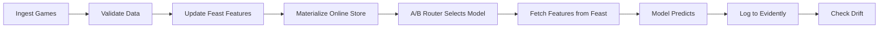

# MLOps Infrastructure Overview

This document provides a comprehensive overview of the MLOps stack for NBA win prediction.

## Architecture

```
┌─────────────────────────────────────────────────────────────────┐
│                     DATA INGESTION LAYER                        │
│  • Contracts (Pydantic): Schema validation at boundary          │
│  • Validators: Business logic checks (30 teams, valid scores)   │
│  • IngestPipeline: Fetch→Normalize→Validate→Persist            │
│  • Manifests: Content-hashed audit trail (.linelogic/manifests) │
└─────────────────────────────────────────────────────────────────┘
                              ↓
┌─────────────────────────────────────────────────────────────────┐
│                     FEATURE STORE (Feast)                       │
│  • team_season_stats: Current season performance                │
│  • Point-in-time correct joins (no data leakage)                │
│  • Online store: Low-latency inference (<10ms)                  │
│  • Offline store: Historical training data                      │
└─────────────────────────────────────────────────────────────────┘
                              ↓
┌─────────────────────────────────────────────────────────────────┐
│                  EXPERIMENT TRACKING (MLflow)                   │
│  • Log: params (C, features), metrics (log_loss, accuracy)      │
│  • Artifacts: model.pkl, metadata.json, features.json           │
│  • Model Registry: staging → production → archived              │
│  • Lineage: Which data trained which model                      │
└─────────────────────────────────────────────────────────────────┘
                              ↓
┌─────────────────────────────────────────────────────────────────┐
│                    INFERENCE SERVING                            │
│  • A/B Router: Traffic split (10% staging, 90% production)      │
│  • Model Loading: mlflow.sklearn.load_model(stage="Production") │
│  • Feature Fetch: Feast online store (team_id → features)       │
│  • Prediction: model.predict_proba(features)                    │
└─────────────────────────────────────────────────────────────────┘
                              ↓
┌─────────────────────────────────────────────────────────────────┐
│                   MONITORING (Evidently)                        │
│  • Data Drift: Feature distribution shifts (net_rating, pace)   │
│  • Model Drift: Prediction distribution changes                 │
│  • Performance: Log_loss degradation over time                  │
│  • Alerts: Slack/email when drift threshold exceeded            │
└─────────────────────────────────────────────────────────────────┘
```

## Component Details

### 1. Data Contracts & Validation

**Purpose**: Prevent bad data from entering pipeline (garbage in = garbage out)

**Location**: 
- `src/linelogic/data/contracts.py` (Pydantic models)
- `src/linelogic/data/validators.py` (business rules)
- `src/linelogic/ingest/pipeline.py` (orchestration)

**Key Features**:
- Strict schema validation (Field constraints: ge, le, min_length)
- Sanity checks (exactly 30 NBA teams, no duplicate IDs)
- Idempotent manifests (content-hashed for deduplication)
- CI gate: PRs blocked if validation fails

**Example**:
```python
# Contract definition
class TeamSeasonStats(BaseModel):
    win_pct: float = Field(..., ge=0.0, le=1.0)  # 0-100% range
    
# Validator
def sanity_check_games(games: list[Game]) -> str | None:
    if any(g.home_team_score < 0 or g.visitor_team_score < 0):
        return "Negative score detected"
    return None
```

### 2. Feast Feature Store

**Purpose**: Consistent features between training (offline) and inference (online)

**Location**: `feature_store/`

**Key Features**:
- Point-in-time correct joins (prevents data leakage in training)
- Online store for sub-10ms inference latency
- Offline store for batch training jobs
- Feature versioning with metadata tags

**Workflow**:
```bash
# 1. Update features (daily after ingest)
python scripts/update_features.py

# 2. Materialize to online store
feast materialize-incremental $(date +%Y-%m-%d)

# 3. Fetch in training
store = FeatureStore(repo_path="feature_store")
training_df = store.get_historical_features(entity_df, features).to_df()

# 4. Fetch in inference
features = store.get_online_features(
    entity_rows=[{"team_id": 1}],
    features=["team_season_stats:win_pct", "team_season_stats:net_rating"],
).to_dict()
```

### 3. MLflow Experiment Tracking

**Purpose**: Reproducibility - answer "which data trained model v1.2.3?"

**Location**: 
- `mlruns/` (tracking data)
- `docs/17_mlflow_tracking.md` (documentation)

**Key Features**:
- Auto-logging in `train_offline.py` (no code changes needed)
- Model registry with staging/production/archived stages
- Run comparison UI (sort by val_log_loss, filter by C>=1.0)
- Artifact storage (model.pkl, metadata.json, features.json)

**Workflow**:
```bash
# 1. Train (automatically logs to MLflow)
python scripts/train_offline.py --output-dir models/

# 2. View experiments
mlflow ui --port 5000

# 3. Load production model
model_uri = "models:/nba_win_predictor/production"
model = mlflow.sklearn.load_model(model_uri)

# 4. Promote to production
client.transition_model_version_stage(
    name="nba_win_predictor", version=3, stage="Production"
)
```

### 4. A/B Testing Router

**Purpose**: Safely test new models on small traffic slice before full rollout

**Location**: `src/linelogic/inference/ab_router.py` (to be implemented)

**Key Features**:
- Traffic splitting by percentage (10% staging, 90% production)
- Session affinity (same user always gets same model)
- Metric collection per variant (compare log_loss, accuracy)
- Gradual rollout (10% → 25% → 50% → 100%)

**Workflow**:
```python
router = ABTestRouter()

# Route prediction request
model_stage = router.route(user_id="abc123")  # Returns "staging" or "production"
model = mlflow.sklearn.load_model(f"models:/nba_win_predictor/{model_stage}")
prediction = model.predict_proba(features)

# Log outcome for both variants
router.log_outcome(user_id="abc123", actual_result=home_won)

# Compare metrics after 1000 predictions
router.compare_variants()  # Shows staging vs production log_loss
```

### 5. Evidently Monitoring

**Purpose**: Detect when model or data drifts from training distribution

**Location**: `src/linelogic/monitoring/` (to be implemented)

**Key Features**:
- Data drift: Chi-squared test for categorical, KS test for continuous
- Model drift: Prediction distribution shift (less confident over time?)
- Performance: Log_loss/accuracy degradation
- Alerts: Slack webhook when drift_score > 0.3

**Workflow**:
```python
from evidently import ColumnMapping
from evidently.report import Report
from evidently.metric_preset import DataDriftPreset

# Daily drift check
report = Report(metrics=[DataDriftPreset()])
report.run(reference_data=training_features, current_data=today_features)

if report.show()["metrics"][0]["result"]["drift_score"] > 0.3:
    send_slack_alert("⚠️ Data drift detected: net_rating distribution shifted")
```

## Operational Workflows

### Daily Inference Pipeline



**Steps**:
1. `scripts/ingest_daily.py`: Fetch today's games, validate, save manifest
2. `scripts/update_features.py`: Compute team_season_stats, write parquet
3. `feast materialize-incremental`: Load features to online store
4. `scripts/infer_daily.py`: Load model via A/B router, predict, log outcomes
5. `scripts/monitor_drift.py`: Check if features/predictions drifted

### Weekly Training Pipeline

```mermaid
graph LR
    A[Fetch Historical Data] --> B[Feature Engineering]
    B --> C[Hyperparameter Search]
    C --> D[Evaluate on Test Set]
    D --> E[Log to MLflow]
    E --> F[Register Model Version]
    F --> G[Transition to Staging]
    G --> H[A/B Test vs Production]
    H --> I[Promote to Production]
```



**Steps**:
1. `scripts/train_offline.py`: Fetch 2019-2024 data, train, log MLflow
2. CI validates model on holdout set (accuracy > 0.52 threshold)
3. `mlflow models transition`: Staging stage for A/B testing
4. Run A/B test for 7 days (10% staging traffic)
5. Compare metrics: `mlflow runs compare --run-ids abc123,def456`
6. If staging_log_loss < production_log_loss: promote
7. Archive old production model for rollback capability

### Incident Response

**Scenario 1: Model predictions suddenly bad**
- Check Evidently dashboard for data drift (did API change schema?)
- Check MLflow: which model version is production? When was it trained?
- Check Feast: is online store stale? (last materialization timestamp)
- Rollback: `mlflow models transition` to previous production version
- Root cause: Compare training data manifest vs current ingest manifest

**Scenario 2: API rate limit hit**
- Check ingest manifests: how many requests today?
- Fallback: Load yesterday's features from Feast offline store
- Alert: Slack notification to upgrade API tier

**Scenario 3: Feature drift detected**
- Retrain model on recent data (last 30 days instead of 2019-2024)
- A/B test new model vs old: does recent data improve accuracy?
- Update training schedule: weekly instead of monthly

## Best Practices

### 1. Data Quality Gates
- ✅ Never train on unvalidated data (contracts must pass)
- ✅ Always log manifest hash with model (data lineage)
- ✅ CI blocks PR if `pytest tests/test_contracts.py` fails

### 2. Model Versioning
- ✅ Every model has MLflow run_id (reproducible)
- ✅ Registered models use semantic versioning (v1.0.0, v1.1.0, v2.0.0)
- ✅ Tags include: data_version, feature_version, ticket_id

### 3. Feature Consistency
- ✅ Training and inference use same Feast feature views (no skew)
- ✅ Features expire after 1 day (force refresh, no stale data)
- ✅ Offline store archives historical features (can retrain 6 months later)

### 4. Safe Deployments
- ✅ All new models start in Staging (never promote directly to Production)
- ✅ A/B test with 10% traffic before full rollout
- ✅ Monitor log_loss for 7 days before promoting
- ✅ Keep previous Production model in Archived (rollback in <5 min)

### 5. Monitoring & Alerting
- ✅ Evidently runs daily (automated cron job)
- ✅ Alerts on: drift_score > 0.3, log_loss > 0.8, feature_missing > 5%
- ✅ Dashboard shows 30-day trend (catching gradual degradation)

## File Structure

```
LineLogic/
├── src/linelogic/
│   ├── data/
│   │   ├── contracts.py          # Pydantic models
│   │   ├── validators.py         # Business logic checks
│   │   └── provider_protocol.py  # API interfaces
│   ├── ingest/
│   │   └── pipeline.py           # IngestPipeline class
│   ├── inference/
│   │   └── ab_router.py          # A/B testing router (TODO)
│   └── monitoring/
│       └── drift.py              # Evidently integration (TODO)
├── feature_store/
│   ├── feature_store.yaml        # Feast config
│   ├── features.py               # Feature view definitions
│   └── data/                     # Registry + online store (auto-created)
├── mlruns/                       # MLflow tracking data (auto-created)
├── .linelogic/
│   ├── manifests/                # Ingest audit trail (content hashes)
│   └── features/                 # Parquet files for Feast
├── docs/
│   ├── 17_mlflow_tracking.md     # MLflow usage guide
│   ├── 18_feast_features.md      # Feast setup (TODO)
│   ├── 19_mlops_architecture.md  # This file
│   └── 20_architecture_principles.md  # SOLID + layered architecture
├── scripts/
│   ├── train_offline.py          # Training with MLflow
│   ├── infer_daily.py            # Inference with Feast + A/B
│   └── monitor_drift.py          # Evidently checks (TODO)
└── tests/
    ├── test_contracts.py         # Data validation tests
    └── test_ab_router.py         # A/B router tests (TODO)
```

## Next Steps

1. **Test MLflow integration**: Run full training pipeline, verify experiments in UI
2. **Initialize Feast**: `cd feature_store && feast apply`
3. **Implement A/B router**: `src/linelogic/inference/ab_router.py`
4. **Add Evidently monitoring**: `scripts/monitor_drift.py`
5. **Document Feast usage**: `docs/18_feast_features.md`
6. **Set up CI for model validation**: `.github/workflows/model_ci.yml`

## References

- [MLflow Documentation](https://mlflow.org/docs/latest/index.html)
- [Feast Documentation](https://docs.feast.dev/)
- [Evidently AI Documentation](https://docs.evidentlyai.com/)
- [Data Contracts (Pydantic)](https://docs.pydantic.dev/)
- [Architecture Decision Records](../adr/)
